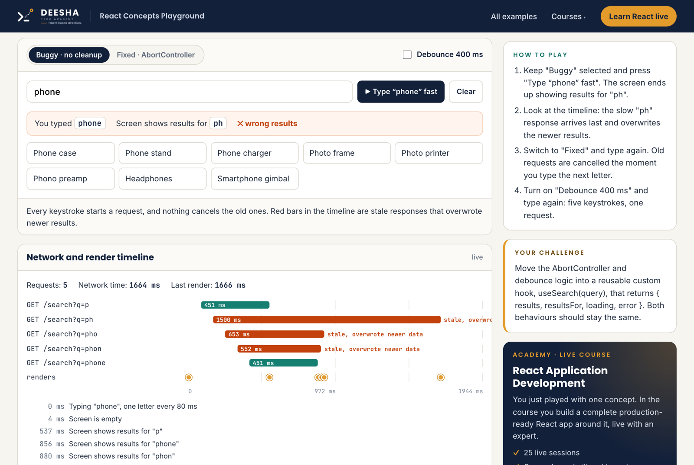
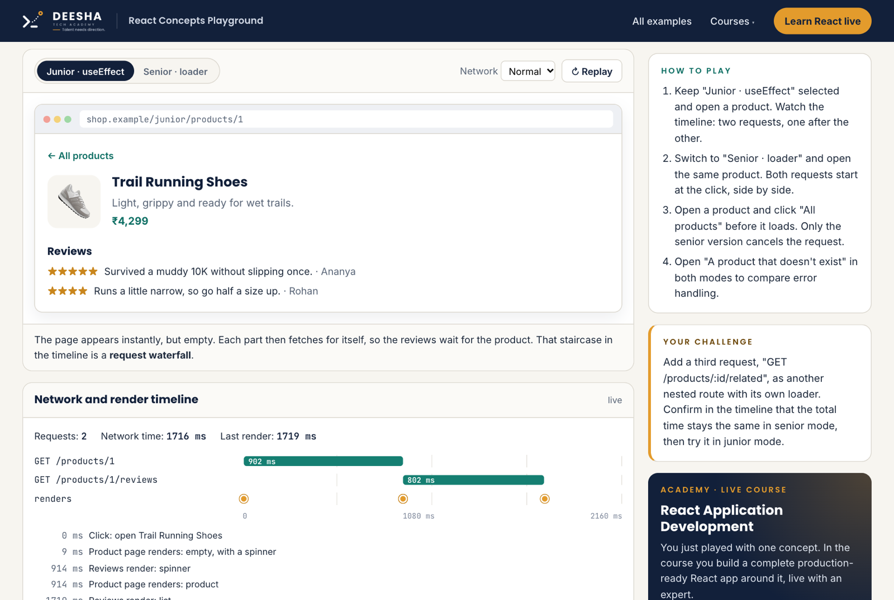

<p align="center">
  <picture>
    <source media="(prefers-color-scheme: dark)" srcset="shell/logo-light.png">
    
  </picture>
</p>

<h1 align="center">React Concepts Playground</h1>

<p align="center">
  <b>Don't just read React. See it happen.</b><br>
  Small, runnable examples from our video series <b>React Important Concepts, Questions &amp; Patterns</b>.<br>
  Watch it · Try it · Explain it.
</p>

<p align="center">
  <a href="https://stackblitz.com/github/deesha-tech/react-concepts-playground/tree/main/examples/19-loaders-vs-useeffect?file=src/senior/routes.tsx"></a>
  &nbsp;
  <a href="https://www.deeshatechacademy.com/academy/courses/react-application-development?utm_source=github&utm_medium=readme&utm_campaign=react-series&utm_content=readme-top"><b>Learn React live with an expert →</b></a>
</p>

---

## ✅ Available now

<table>
  <tr>
    <td width="50%" valign="top">
      <a href="examples/01-race-conditions"></a>
      <h3>Ep 01 · Race Conditions</h3>
      <p>Type "phone", get results for "ph". Watch the slow response overwrite the right one on the timeline, then fix it with AbortController and debounce.</p>
      <p><a href="https://stackblitz.com/github/deesha-tech/react-concepts-playground/tree/main/examples/01-race-conditions?file=src/FixedSearch.tsx"></a></p>
    </td>
    <td width="50%" valign="top">
      <a href="examples/19-loaders-vs-useeffect"></a>
      <h3>Ep 19 · Loaders vs useEffect</h3>
      <p>See the request waterfall that useEffect fetching causes, then switch to React Router loaders: parallel requests, error boundaries and cancellation.</p>
      <p><a href="https://stackblitz.com/github/deesha-tech/react-concepts-playground/tree/main/examples/19-loaders-vs-useeffect?file=src/senior/routes.tsx"></a></p>
    </td>
  </tr>
</table>

## ▶️ How to play with an example in StackBlitz

No installs and no setup. Everything runs in your browser.

1. **Click "Open in StackBlitz"** next to an example. StackBlitz loads the project and runs `npm install` for you. The first load takes a minute.
2. **The app opens on the right, the code on the left.** The file that matters most for the concept opens automatically.
3. **Play with the demo.** Use the toggle to switch between the problem and the fix, and watch the **network and render timeline** show every request and render as it happens.
4. **Read the highlighted code** under the demo: these are the lines that make the difference.
5. **Take the challenge** in the sidebar. Edit the code on the left; the app reloads as you type.
6. **Read the interview question** at the bottom: a model answer, a 30-second version and the follow-ups interviewers ask.
7. **Keep your version.** Click **Fork** in StackBlitz (sign in with GitHub) to save your changes to your own account.

## 📚 The full series

New examples arrive with each episode. Follow along on Instagram and YouTube so you don't miss one.

| Ep | Concept | What you'll learn | Playground |
|---|---|---|---|
| **01** | **[Race Conditions](examples/01-race-conditions)** | **The React interview question most candidates miss** | ✅ **[Open in StackBlitz](https://stackblitz.com/github/deesha-tech/react-concepts-playground/tree/main/examples/01-race-conditions?file=src/FixedSearch.tsx)** |
| 02 | Cart Empty After Refresh | Persist state the right way, and survive the next release | 🔜 Coming soon |
| 03 | One Crash, Blank App | Error Boundaries, and what they can't catch | 🔜 Coming soon |
| 04 | A Hook Inside an If | Why hooks must be called at the top level | 🔜 Coming soon |
| 05 | Counter Stuck at 1 | Stale closures, explained in 90 seconds | 🔜 Coming soon |
| 06 | The Dependency Array | No array vs [] vs [a, b], once and for all | 🔜 Coming soon |
| 07 | Why useEffect Runs Twice | StrictMode, and why it's actually helping you | 🔜 Coming soon |
| 08 | Index as Key Bug | Why key={index} breaks lists | 🔜 Coming soon |
| 09 | You Might Not Need an Effect | Derived state and event handlers over effects | 🔜 Coming soon |
| 10 | Controlled vs Uncontrolled | When to use each, with real form examples | 🔜 Coming soon |
| 11 | The Context Re-render Trap | Why one big Context hurts, and three fixes | 🔜 Coming soon |
| 12 | useMemo & useCallback Myths | When memoisation helps, and when it's useless | 🔜 Coming soon |
| 13 | Build a Custom Hook | The custom hook pattern every interviewer asks about | 🔜 Coming soon |
| 14 | Props, Context or Store? | A simple decision guide for state in React | 🔜 Coming soon |
| 15 | Filters in the URL | Shareable, refresh-proof, back-button friendly | 🔜 Coming soon |
| 16 | Token Expires Mid-Request | The axios refresh queue senior devs use | 🔜 Coming soon |
| 17 | Axios Interceptors | One API layer: interceptors and a single ApiError | 🔜 Coming soon |
| 18 | Protected Routes & Roles | Route guards, and why the server must check too | 🔜 Coming soon |
| **19** | **[Loaders vs useEffect](examples/19-loaders-vs-useeffect)** | **Data before render with React Router loaders** | ✅ **[Open in StackBlitz](https://stackblitz.com/github/deesha-tech/react-concepts-playground/tree/main/examples/19-loaders-vs-useeffect?file=src/senior/routes.tsx)** |
| 20 | Slow Loader Blocks Navigation | Await only what's critical, stream the rest | 🔜 Coming soon |
| 21 | Optimistic UI | Optimistic updates, with rollback when things fail | 🔜 Coming soon |
| 22 | Forms with RHF + Zod | react-hook-form + Zod, the production setup | 🔜 Coming soon |
| 23 | 10,000 Rows Are Janky | Measure first, then virtualise | 🔜 Coming soon |
| 24 | 50 Updates a Second | Batch the stream, select only what changed | 🔜 Coming soon |
| 25 | Server State vs Client State | TanStack Query / RTK Query for server state | 🔜 Coming soon |
| 26 | Zustand vs Redux Toolkit | Same feature, two stores, when to pick which | 🔜 Coming soon |
| 27 | Compound Components | The compound component pattern | 🔜 Coming soon |
| 28 | Modals with Portals | Portals, z-index and overflow, explained | 🔜 Coming soon |
| 29 | React 19 Actions | Actions, useActionState and pending states | 🔜 Coming soon |
| 30 | What to Test in React | Test what users see, with React Testing Library | 🔜 Coming soon |

## What every example includes

- a **live demo** with a toggle between the problem and the fix
- a **network and render timeline**, so you see what the code does, not just read about it
- the **key lines of code**, highlighted
- the **interview question** with a model answer, a 30-second version and follow-ups
- a small **challenge** to try on your own

## Run an example locally

```bash
git clone https://github.com/deesha-tech/react-concepts-playground.git
cd react-concepts-playground/examples/19-loaders-vs-useeffect
npm install
npm run dev
```

Each example is a self-contained Vite + React + TypeScript project. There is no backend: a small fake API with realistic delays stands in for the server.

## Built from the same stack as the course

React 19 · React Router 8 · TypeScript strict · Vite. These examples teach one concept each. In our **React Application Development** course you build a complete production-ready app around all of them, live: routing, data loading, auth, state management, testing, CI and deployment.

- 🚀 **React Application Development**: [deeshatechacademy.com/academy/courses/react-application-development](https://www.deeshatechacademy.com/academy/courses/react-application-development?utm_source=github&utm_medium=readme&utm_campaign=react-series&utm_content=readme)
- 🌐 **Everything else we teach**: [deeshatechacademy.com](https://www.deeshatechacademy.com/?utm_source=github&utm_medium=readme&utm_campaign=react-series)

## For contributors

The Deesha header, menu, course cards and timeline live in [`shell/`](shell). Every example has its own copy so StackBlitz can open each folder on its own. After editing `shell/`, run:

```bash
npm run sync
```

To add an example, copy an existing folder in `examples/`, change `src/episode.ts`, `package.json` and `index.html`, and replace the demo.

## Licence

These examples are for **learning and teaching**. You can read, run, change and share them for personal study, in classrooms and for any other non-commercial purpose. Using them in a paid course, product or service needs our written permission: contact@deeshatechacademy.com.

Licensed under the [PolyForm Noncommercial License 1.0.0](LICENSE).

---

<p align="center">© 2026 <a href="https://www.deeshatechacademy.com/?utm_source=github&utm_medium=readme&utm_campaign=react-series">Deesha Tech Academy</a> · Talent needs direction.</p>
